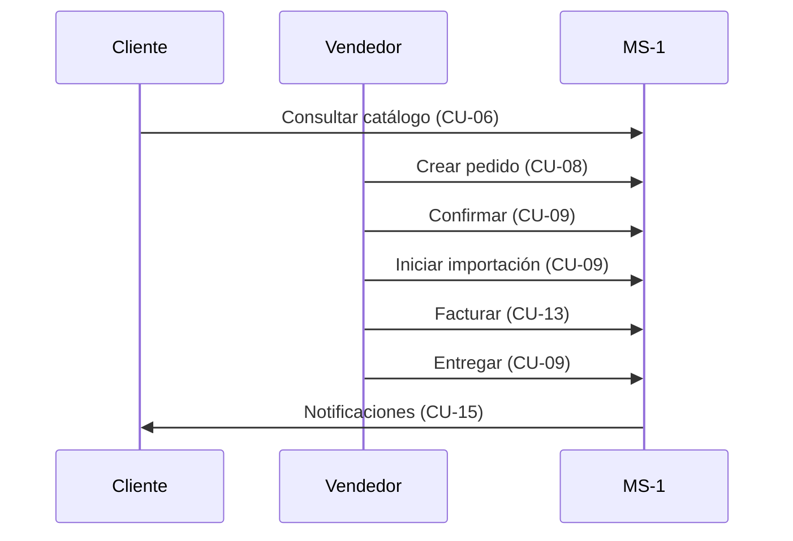

# Casos de uso — MS-1 Principal

Microservicio central (Spring Boot) para autenticación, inventario, ventas, importaciones, facturación y reportes.

**API base:** `/api/v1`

**Especificación detallada (UML + PUDS):** [CASOS_DE_USO_MS1_DETALLE_PUDS.md](./CASOS_DE_USO_MS1_DETALLE_PUDS.md)

**Historias de usuario (HU):** [HISTORIAS_USUARIO_MS1.md](./HISTORIAS_USUARIO_MS1.md)

---

## Actores

| Actor | Descripción |
|-------|-------------|
| **Visitante** | Usuario no autenticado |
| **Cliente** | Comprador registrado |
| **Vendedor** | Ejecutivo comercial |
| **Administrador** | Control total del sistema |

---

## Catálogo de casos de uso

| ID | Nombre | Función |
|----|--------|---------|
| **CU-01** | Autenticarse en el sistema | Permite iniciar sesión con usuario/contraseña o Google y obtener un token JWT para acceder al sistema. |
| **CU-02** | Registrarse | Permite a un visitante crear una cuenta nueva como Cliente o Vendedor. |
| **CU-03** | Gestionar usuarios | Permite al administrador listar, crear, activar/desactivar usuarios y restablecer contraseñas. |
| **CU-04** | Gestionar clientes | Permite registrar, editar, activar/desactivar clientes y asignarlos al vendedor logueado. |
| **CU-05** | Consultar datos de cliente | Permite al cliente ver su información personal y los pedidos asociados a su cuenta. |
| **CU-06** | Consultar catálogo | Permite listar y ver el detalle de vehículos disponibles (acceso público, sin login). |
| **CU-07** | Gestionar inventario | Permite registrar, actualizar y eliminar vehículos del inventario de la importadora. |
| **CU-08** | Crear pedido | Permite asociar un cliente con un vehículo, calcular el total de la venta y reservar el vehículo. |
| **CU-09** | Gestionar ciclo del pedido | Permite avanzar un pedido (confirmar → importación → entrega) o cancelarlo/cerrarlo con motivo. |
| **CU-10** | Tomar pedido sin vendedor | Permite a un vendedor auto-asignarse un pedido que quedó sin responsable comercial. |
| **CU-11** | Consultar pedidos | Permite listar y ver el detalle de pedidos (el cliente solo ve los suyos). |
| **CU-12** | Gestionar importaciones | Permite registrar y actualizar la trazabilidad aduanera de los vehículos importados. |
| **CU-13** | Gestionar facturas | Permite crear una factura en borrador, emitirla y registrar su pago. |
| **CU-14** | Gestionar equipo de ventas | Permite al administrador administrar vendedores y consultar sus KPIs de desempeño. |
| **CU-15** | Consultar y gestionar alertas | Permite ver notificaciones del sistema, filtrarlas, contar las no leídas y marcarlas como leídas. |
| **CU-16** | Consultar métricas del negocio | Permite al administrador ver ventas, stock, pedidos, clientes e importaciones del negocio completo. |
| **CU-17** | Consultar métricas propias | Permite al vendedor ver un resumen de sus ventas y operaciones comerciales. |

---

## Casos de uso por módulo

### Autenticación y acceso

| ID | Caso de uso | Actor | Descripción |
|----|-------------|-------|-------------|
| CU-01 | Autenticarse en el sistema | Todos | Login con usuario/contraseña o Google; obtiene JWT |
| CU-02 | Registrarse | Visitante | Alta pública como Cliente o Vendedor |

### Administración de usuarios

| ID | Caso de uso | Actor | Descripción |
|----|-------------|-------|-------------|
| CU-03 | Gestionar usuarios | Admin | Listar, crear, activar/desactivar y restablecer contraseñas |

### Clientes

| ID | Caso de uso | Actor | Descripción |
|----|-------------|-------|-------------|
| CU-04 | Gestionar clientes | Admin, Vendedor | CRUD, activar/desactivar y asignar cliente al vendedor logueado |
| CU-05 | Consultar datos de cliente | Cliente | Ver su propia información y pedidos asociados |

### Inventario de vehículos

| ID | Caso de uso | Actor | Descripción |
|----|-------------|-------|-------------|
| CU-06 | Consultar catálogo | Todos (público) | Listar y ver detalle de vehículos disponibles |
| CU-07 | Gestionar inventario | Admin, Vendedor | Registrar, actualizar y eliminar vehículos |

### Pedidos (ventas)

| ID | Caso de uso | Actor | Descripción |
|----|-------------|-------|-------------|
| CU-08 | Crear pedido | Admin, Vendedor | Asocia cliente + vehículo; calcula total; reserva el vehículo |
| CU-09 | Gestionar ciclo del pedido | Admin, Vendedor | Confirmar → iniciar importación → entregar; o cancelar/cerrar |
| CU-10 | Tomar pedido sin vendedor | Vendedor | Auto-asignarse un pedido pendiente de responsable |
| CU-11 | Consultar pedidos | Admin, Vendedor, Cliente | Listar y ver detalle (cliente solo ve los suyos) |

**Estados del pedido:** `PENDIENTE` → `CONFIRMADO` → `EN_IMPORTACION` → `ENTREGADO` | `CANCELADO`

**Estados del vehículo:** `DISPONIBLE` → `RESERVADO` → `EN_IMPORTACION` → `VENDIDO`

### Importaciones (logística aduanera)

| ID | Caso de uso | Actor | Descripción |
|----|-------------|-------|-------------|
| CU-12 | Gestionar importaciones | Admin | CRUD y actualización de trazabilidad aduanera |

> También se dispara automáticamente al iniciar importación desde un pedido (CU-09).

**Estados:** `SOLICITADA` → `EN_ADUANA` → `LIBERADA` → `EN_TRANSITO` → `COMPLETADA`

### Facturación

| ID | Caso de uso | Actor | Descripción |
|----|-------------|-------|-------------|
| CU-13 | Gestionar facturas | Admin, Vendedor | Crear borrador, emitir y registrar pago |

**Estados:** `BORRADOR` → `EMITIDA` → `PAGADA`

### Vendedores

| ID | Caso de uso | Actor | Descripción |
|----|-------------|-------|-------------|
| CU-14 | Gestionar equipo de ventas | Admin | CRUD de vendedores, activar/desactivar y consultar KPIs |

### Notificaciones

| ID | Caso de uso | Actor | Descripción |
|----|-------------|-------|-------------|
| CU-15 | Consultar y gestionar alertas | Todos | Listar, filtrar, contar no leídas y marcar como leídas |

El sistema genera alertas automáticas al crear, confirmar, importar, entregar o cancelar pedidos.

### Reportes

| ID | Caso de uso | Actor | Descripción |
|----|-------------|-------|-------------|
| CU-16 | Consultar métricas del negocio | Admin | Ventas, pedidos, stock, clientes, importaciones y ranking de vendedores |
| CU-17 | Consultar métricas propias | Vendedor | Resumen de ventas y operaciones del vendedor logueado |

---

## Flujo principal de negocio

```
Consultar catálogo → Crear pedido → Confirmar → Iniciar importación → Facturar → Entregar
```



---

## Matriz actor × caso de uso

| Caso de uso | Visitante | Cliente | Vendedor | Admin |
|-------------|:---------:|:-------:|:--------:|:-----:|
| CU-01 Autenticarse | ✓ | ✓ | ✓ | ✓ |
| CU-02 Registrarse | ✓ | | | |
| CU-03 Usuarios | | | | ✓ |
| CU-04 Clientes (gestión) | | | ✓ | ✓ |
| CU-05 Clientes (consulta) | | ✓ | | |
| CU-06 Catálogo | ✓ | ✓ | ✓ | ✓ |
| CU-07 Inventario | | | ✓ | ✓ |
| CU-08–11 Pedidos | | ✓ | ✓ | ✓ |
| CU-12 Importaciones | | | | ✓ |
| CU-13 Facturas | | | ✓ | ✓ |
| CU-14 Vendedores | | | | ✓ |
| CU-15 Notificaciones | | ✓ | ✓ | ✓ |
| CU-16 Reportes globales | | | | ✓ |
| CU-17 Reportes propios | | | ✓ | |

---

## Reglas de negocio clave

1. Solo se puede vender un vehículo en estado **DISPONIBLE** sin pedido activo.
2. Al crear un pedido se reserva el vehículo y se calcula: precio + impuestos (15%) + envío.
3. Un pedido sin vendedor genera alerta al equipo comercial.
4. La entrega requiere pedido en **EN_IMPORTACION**; el vehículo pasa a **VENDIDO**.
5. Cancelar un pedido libera el vehículo de vuelta a **DISPONIBLE**.

---

## Resumen

| Concepto | Valor |
|----------|-------|
| Casos de uso | **17** (consolidados) |
| Módulos | 10 |
| Roles | ADMIN, VENDEDOR, CLIENTE |
