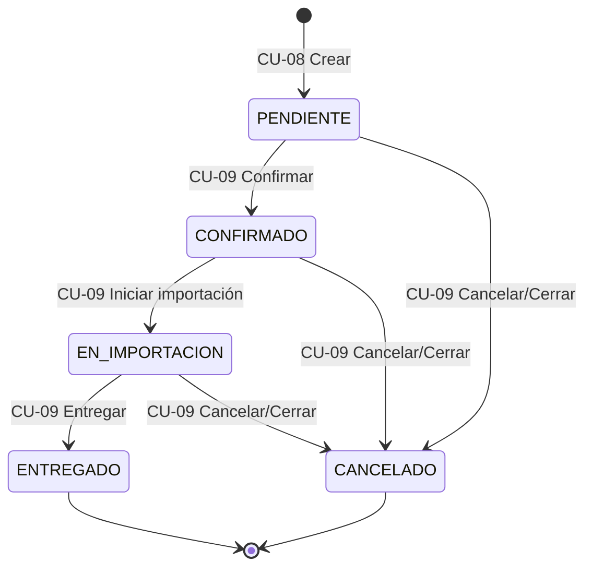

# Especificación detallada de casos de uso — MS-1 Principal

Documento de requisitos funcionales según **UML 2.x** (especificación de casos de uso) y **PUDS** (Procedimientos Uniformes de Desarrollo de Software).

| Campo | Valor |
|-------|-------|
| **Sistema** | MS-1 Principal — Importadora de Vehículos 2026 |
| **Versión API** | `/api/v1` |
| **Total CU** | 17 |
| **Documento relacionado** | [CASOS_DE_USO_MS1.md](./CASOS_DE_USO_MS1.md) |

---

## 1. Convenciones del documento

### 1.1 Estructura UML por caso de uso

Cada CU incluye los campos estándar de la especificación UML:

| Campo | Descripción |
|-------|-------------|
| **Actor primario** | Quien inicia la interacción |
| **Actores secundarios** | Sistemas o roles que participan sin iniciar |
| **Alcance** | Límite del sistema (MS-1) |
| **Nivel** | Objetivo de usuario / Subfunción |
| **Disparador** | Evento que inicia el caso de uso |
| **Precondiciones** | Condiciones que deben cumplirse antes |
| **Postcondiciones (éxito)** | Estado del sistema tras finalizar correctamente |
| **Garantía mínima (fallo)** | Estado del sistema si falla |
| **Flujo principal** | Secuencia nominal de pasos |
| **Flujos alternos** | Variaciones válidas del flujo |
| **Flujos de excepción** | Manejo de errores y rechazos |
| **Reglas de negocio** | Restricciones del dominio |
| **Requisitos especiales** | No funcionales aplicables |
| **Relaciones UML** | `<<include>>`, `<<extend>>` con otros CU |

### 1.2 Notación PUDS

| Sección PUDS | Equivalente UML |
|--------------|-----------------|
| Curso normal | Flujo principal |
| Cursos alternos | Flujos alternos |
| Excepciones | Flujos de excepción |
| Reglas de negocio | Reglas de negocio |

---

## 2. Diagrama general de actores y casos de uso

```mermaid
flowchart TB
    subgraph Actores
        V[Visitante]
        C[Cliente]
        VE[Vendedor]
        A[Administrador]
        S[Sistema MS-1]
    end

    subgraph Autenticacion
        CU01[CU-01 Autenticarse]
        CU02[CU-02 Registrarse]
    end

    subgraph Administracion
        CU03[CU-03 Gestionar usuarios]
        CU14[CU-14 Gestionar vendedores]
    end

    subgraph Comercial
        CU04[CU-04 Gestionar clientes]
        CU05[CU-05 Consultar cliente]
        CU06[CU-06 Consultar catálogo]
        CU07[CU-07 Gestionar inventario]
        CU08[CU-08 Crear pedido]
        CU09[CU-09 Gestionar ciclo pedido]
        CU10[CU-10 Tomar pedido]
        CU11[CU-11 Consultar pedidos]
        CU13[CU-13 Gestionar facturas]
    end

    subgraph Logistica
        CU12[CU-12 Gestionar importaciones]
    end

    subgraph Transversal
        CU15[CU-15 Gestionar alertas]
        CU16[CU-16 Métricas negocio]
        CU17[CU-17 Métricas vendedor]
    end

    V --> CU02
    V --> CU06
    C --> CU01
    C --> CU05
    C --> CU11
    C --> CU15
    VE --> CU01
    VE --> CU04
    VE --> CU07
    VE --> CU08
    VE --> CU09
    VE --> CU10
    VE --> CU11
    VE --> CU13
    VE --> CU15
    VE --> CU17
    A --> CU03
    A --> CU04
    A --> CU07
    A --> CU08
    A --> CU09
    A --> CU11
    A --> CU12
    A --> CU13
    A --> CU14
    A --> CU15
    A --> CU16
    S -.-> CU15
    CU08 -.->|include| CU15
    CU09 -.->|include| CU12
    CU09 -.->|include| CU15
```

### 2.1 Relaciones UML entre casos de uso

| Relación | Origen | Destino | Descripción |
|----------|--------|---------|-------------|
| `<<include>>` | CU-03 a CU-17 (protegidos) | CU-01 | Toda operación autenticada requiere sesión JWT válida |
| `<<include>>` | CU-08, CU-09 | CU-15 | Crear o cambiar pedido genera notificaciones |
| `<<include>>` | CU-09 (iniciar importación) | CU-12 | Al avanzar pedido se crea/actualiza registro aduanero |
| `<<extend>>` | CU-01 | CU-02 | El registro es una variante previa al acceso autenticado |

---

## 3. Especificación detallada por caso de uso

---

### CU-01 — Autenticarse en el sistema

| Campo UML/PUDS | Detalle |
|----------------|---------|
| **ID** | CU-01 |
| **Actor primario** | Cliente, Vendedor, Administrador |
| **Actores secundarios** | Google OAuth (login con Google), Sistema JWT |
| **Alcance** | MS-1 Principal |
| **Nivel** | Objetivo de usuario |
| **Descripción** | El actor valida su identidad y obtiene un token JWT para acceder a funciones protegidas del sistema. |
| **Disparador** | El actor selecciona "Iniciar sesión" en la aplicación web. |
| **Precondiciones** | El usuario existe en el sistema y está activo (excepto registro previo en CU-02). |
| **Postcondiciones (éxito)** | Se genera JWT con rol, username y datos de cliente (si aplica). |
| **Garantía mínima (fallo)** | No se emite token; la sesión permanece anónima. |

#### Flujo principal

1. El actor ingresa username y contraseña.
2. El sistema valida credenciales con `AuthenticationManager`.
3. El sistema carga el usuario y su perfil de cliente vinculado.
4. El sistema genera JWT con expiración configurada.
5. El sistema retorna `LoginResponse` (token, rol, clienteId, clienteNombre).

#### Flujos alternos

**FA-01.1 — Login con Google**

1. El actor selecciona "Continuar con Google".
2. El frontend obtiene `idToken` de Google GIS.
3. El sistema verifica el token con `GoogleTokenVerifier`.
4. El sistema busca usuario por email verificado.
5. Continúa en paso 4 del flujo principal.

**FA-01.2 — Consultar config antes de login**

1. El visitante consulta `GET /auth/config` para obtener Google Client ID.
2. Continúa con FA-01.1 si Google está habilitado.

#### Flujos de excepción

| ID | Condición | Respuesta |
|----|-----------|-----------|
| FE-01.1 | Credenciales incorrectas | `401` — Credenciales inválidas |
| FE-01.2 | Usuario inactivo | `401` — Usuario inactivo |
| FE-01.3 | Email Google no registrado | `401` — Solicitar acceso al administrador |
| FE-01.4 | Email Google no verificado | `401` — Correo no verificado |

#### Reglas de negocio

- RN-01.1: El token JWT incluye el rol (`ADMIN`, `VENDEDOR`, `CLIENTE`).
- RN-01.2: Login con Google solo funciona si el email ya existe en el sistema.

#### Requisitos especiales

- Autenticación stateless (sin sesión HTTP).
- Contraseñas almacenadas con BCrypt.

#### Endpoints

- `GET /api/v1/auth/config`
- `POST /api/v1/auth/login`
- `POST /api/v1/auth/google`

---

### CU-02 — Registrarse

| Campo UML/PUDS | Detalle |
|----------------|---------|
| **ID** | CU-02 |
| **Actor primario** | Visitante |
| **Actores secundarios** | Sistema JWT |
| **Alcance** | MS-1 Principal |
| **Nivel** | Objetivo de usuario |
| **Descripción** | Un visitante crea una cuenta como Cliente o Vendedor y accede inmediatamente al sistema. |
| **Disparador** | El visitante selecciona "Registrarse". |
| **Precondiciones** | El email no está registrado previamente. |
| **Postcondiciones (éxito)** | Usuario activo creado; si es Cliente, también se crea registro en tabla `clientes`. |
| **Garantía mínima (fallo)** | No se crea usuario ni cliente. |

#### Flujo principal

1. El visitante completa formulario: nombre, email, teléfono, contraseña, confirmación y rol (`CLIENTE` o `VENDEDOR`).
2. El sistema valida que las contraseñas coincidan.
3. El sistema verifica unicidad del email.
4. El sistema genera username único a partir del email.
5. Si el rol es `CLIENTE`, crea registro de cliente con código `CLI-XXX` y tipo `NUEVO`.
6. El sistema persiste el usuario con contraseña encriptada.
7. El sistema emite JWT y retorna `LoginResponse` (HTTP 201).

#### Flujos alternos

**FA-02.1 — Registro como Vendedor**

- En paso 5 no se crea entidad Cliente; solo Usuario con rol VENDEDOR.

#### Flujos de excepción

| ID | Condición | Respuesta |
|----|-----------|-----------|
| FE-02.1 | Contraseñas no coinciden | `400` — BusinessRuleException |
| FE-02.2 | Rol ADMIN solicitado | `400` — No permitido en registro público |
| FE-02.3 | Email duplicado | `409` — DuplicateResourceException |

#### Reglas de negocio

- RN-02.1: El rol ADMIN no puede registrarse públicamente.
- RN-02.2: Clientes registrados reciben documento temporal `WEB-{timestamp}`.
- RN-02.3: Tipo de cliente inicial: `NUEVO`.

#### Relaciones UML

- `<<extend>>` CU-01 — Tras registrarse el actor queda autenticado.

#### Endpoints

- `POST /api/v1/auth/register`

---

### CU-03 — Gestionar usuarios

| Campo UML/PUDS | Detalle |
|----------------|---------|
| **ID** | CU-03 |
| **Actor primario** | Administrador |
| **Actores secundarios** | — |
| **Alcance** | MS-1 Principal |
| **Nivel** | Objetivo de usuario |
| **Descripción** | El administrador administra cuentas del sistema: alta, consulta, activación y reseteo de contraseñas. |
| **Disparador** | El admin accede al módulo de usuarios. |
| **Precondiciones** | Sesión activa con rol ADMIN (`<<include>>` CU-01). |
| **Postcondiciones (éxito)** | Usuarios actualizados según la operación solicitada. |
| **Garantía mínima (fallo)** | Datos de usuarios sin cambios. |

#### Flujo principal — Crear usuario

1. El admin ingresa username, email, contraseña, rol y clienteId (si rol CLIENTE).
2. El sistema valida permisos y unicidad de username/email.
3. El sistema vincula cliente si el rol lo requiere.
4. El sistema persiste usuario activo con contraseña encriptada.
5. Retorna `UsuarioResponse`.

#### Flujos alternos

| ID | Operación | Endpoint |
|----|-----------|----------|
| FA-03.1 | Listar usuarios | `GET /usuarios` |
| FA-03.2 | Activar/desactivar | `POST /usuarios/{id}/toggle-activo` |
| FA-03.3 | Desactivar (DELETE) | `DELETE /usuarios/{id}` |
| FA-03.4 | Restablecer contraseña | `PUT /usuarios/{id}/password` |

#### Flujos de excepción

| ID | Condición | Respuesta |
|----|-----------|-----------|
| FE-03.1 | Username o email duplicado | `409` |
| FE-03.2 | Usuario no encontrado | `404` |
| FE-03.3 | Actor sin rol ADMIN | `403` |

#### Reglas de negocio

- RN-03.1: Solo ADMIN puede gestionar usuarios.
- RN-03.2: Usuario CLIENTE debe vincularse a un registro de cliente existente.

#### Endpoints

- `GET/POST /api/v1/usuarios`
- `POST /api/v1/usuarios/{id}/toggle-activo`
- `DELETE /api/v1/usuarios/{id}`
- `PUT /api/v1/usuarios/{id}/password`

---

### CU-04 — Gestionar clientes

| Campo UML/PUDS | Detalle |
|----------------|---------|
| **ID** | CU-04 |
| **Actor primario** | Administrador, Vendedor |
| **Actores secundarios** | — |
| **Alcance** | MS-1 Principal |
| **Nivel** | Objetivo de usuario |
| **Descripción** | Registro y mantenimiento de la cartera de clientes comerciales de la importadora. |
| **Disparador** | El actor accede al módulo de clientes. |
| **Precondiciones** | Sesión activa con rol ADMIN o VENDEDOR. |
| **Postcondiciones (éxito)** | Datos de cliente creados, actualizados o cambiados de estado. |
| **Garantía mínima (fallo)** | Cliente conserva su estado anterior. |

#### Flujo principal — Registrar cliente

1. El actor ingresa datos: documento, nombres, apellidos, email, teléfono, tipo (`VIP`, `REGULAR`, `NUEVO`).
2. El sistema valida unicidad de documento y email.
3. El sistema persiste cliente con código `CLI-XXX`.
4. Retorna `ClienteResponse`.

#### Flujos alternos

| ID | Operación | Descripción |
|----|-----------|-------------|
| FA-04.1 | Listar / consultar | Ver todos los clientes o uno por ID |
| FA-04.2 | Actualizar | Modificar datos del cliente |
| FA-04.3 | Toggle activo | Activar o desactivar sin eliminar |
| FA-04.4 | Asignar a mí | Vendedor toma ownership del cliente |
| FA-04.5 | Desactivar (Admin) | Eliminación lógica vía DELETE |

#### Flujos de excepción

| ID | Condición | Respuesta |
|----|-----------|-----------|
| FE-04.1 | Documento o email duplicado | `409` |
| FE-04.2 | Cliente no encontrado | `404` |
| FE-04.3 | Vendedor sin permiso DELETE | `403` |

#### Reglas de negocio

- RN-04.1: Solo ADMIN puede desactivar vía DELETE.
- RN-04.2: Un cliente inactivo no puede usarse en nuevos pedidos.

#### Endpoints

- `GET/POST /api/v1/clientes`
- `GET/PUT /api/v1/clientes/{id}`
- `POST /api/v1/clientes/{id}/toggle-activo`
- `POST /api/v1/clientes/{id}/asignar-a-mi`
- `DELETE /api/v1/clientes/{id}`

---

### CU-05 — Consultar datos de cliente

| Campo UML/PUDS | Detalle |
|----------------|---------|
| **ID** | CU-05 |
| **Actor primario** | Cliente |
| **Actores secundarios** | — |
| **Alcance** | MS-1 Principal |
| **Nivel** | Objetivo de usuario |
| **Descripción** | El cliente autenticado consulta su perfil y pedidos asociados a su cuenta. |
| **Disparador** | El cliente accede a "Mi cuenta" o "Mis pedidos". |
| **Precondiciones** | Sesión activa con rol CLIENTE vinculado a un registro de cliente. |
| **Postcondiciones (éxito)** | Se muestran solo datos del cliente propietario de la sesión. |
| **Garantía mínima (fallo)** | No se expone información de terceros. |

#### Flujo principal

1. El cliente solicita su información (`GET /clientes/{id}`) o sus pedidos (`GET /pedidos/cliente/{clienteId}`).
2. El sistema valida que `clienteId` coincida con el cliente de la sesión (`SecurityActor.validarClientePropio`).
3. El sistema retorna los datos solicitados.

#### Flujos de excepción

| ID | Condición | Respuesta |
|----|-----------|-----------|
| FE-05.1 | Cliente intenta ver datos de otro | `403` — BusinessRuleException |
| FE-05.2 | Cliente no encontrado | `404` |

#### Reglas de negocio

- RN-05.1: Aislamiento de datos — un CLIENTE solo accede a su propio `clienteId`.

#### Relaciones UML

- `<<include>>` CU-01, CU-11

#### Endpoints

- `GET /api/v1/clientes/{id}`
- `GET /api/v1/pedidos/cliente/{clienteId}`

---

### CU-06 — Consultar catálogo

| Campo UML/PUDS | Detalle |
|----------------|---------|
| **ID** | CU-06 |
| **Actor primario** | Visitante (y cualquier actor autenticado) |
| **Actores secundarios** | — |
| **Alcance** | MS-1 Principal |
| **Nivel** | Objetivo de usuario |
| **Descripción** | Consulta pública del inventario de vehículos disponibles para venta. |
| **Disparador** | El actor accede al catálogo o landing de vehículos. |
| **Precondiciones** | Ninguna (endpoint público). |
| **Postcondiciones (éxito)** | Lista o detalle de vehículos retornado. |
| **Garantía mínima (fallo)** | Respuesta vacía o error HTTP; sin cambios en datos. |

#### Flujo principal

1. El actor solicita listado (`GET /vehiculos`) o detalle (`GET /vehiculos/{id}`).
2. El sistema consulta inventario en base de datos.
3. Retorna `VehiculoResponse` con marca, modelo, precio, estado, imagen, etc.

#### Flujos alternos

**FA-06.1 — Consulta desde cliente autenticado**

- Mismo flujo; no requiere token.

#### Flujos de excepción

| ID | Condición | Respuesta |
|----|-----------|-----------|
| FE-06.1 | Vehículo no existe | `404` |

#### Reglas de negocio

- RN-06.1: GET de vehículos es público según `SecurityConfig`.

#### Endpoints

- `GET /api/v1/vehiculos`
- `GET /api/v1/vehiculos/{id}`

---

### CU-07 — Gestionar inventario

| Campo UML/PUDS | Detalle |
|----------------|---------|
| **ID** | CU-07 |
| **Actor primario** | Administrador, Vendedor |
| **Actores secundarios** | — |
| **Alcance** | MS-1 Principal |
| **Nivel** | Objetivo de usuario |
| **Descripción** | Alta, modificación y baja de vehículos en el inventario de la importadora. |
| **Disparador** | El actor accede al módulo de inventario. |
| **Precondiciones** | Sesión activa con rol ADMIN o VENDEDOR. |
| **Postcondiciones (éxito)** | Inventario actualizado. |
| **Garantía mínima (fallo)** | Vehículo conserva estado anterior. |

#### Flujo principal — Registrar vehículo

1. El actor ingresa datos: VIN, marca, modelo, año, precio, color, imagen URL, país origen.
2. El sistema valida datos de entrada.
3. El sistema persiste vehículo con estado inicial `DISPONIBLE`.
4. Retorna `VehiculoResponse` (HTTP 201).

#### Flujos alternos

| ID | Operación | Actor |
|----|-----------|-------|
| FA-07.1 | Actualizar vehículo | Admin, Vendedor |
| FA-07.2 | Eliminar vehículo | Solo Admin |

#### Flujos de excepción

| ID | Condición | Respuesta |
|----|-----------|-----------|
| FE-07.1 | Vehículo no encontrado | `404` |
| FE-07.2 | Vendedor intenta eliminar | `403` |

#### Reglas de negocio

- RN-07.1: Estados posibles: `DISPONIBLE`, `RESERVADO`, `VENDIDO`, `EN_IMPORTACION`.
- RN-07.2: Solo ADMIN puede eliminar vehículos.

#### Endpoints

- `POST /api/v1/vehiculos`
- `PUT /api/v1/vehiculos/{id}`
- `DELETE /api/v1/vehiculos/{id}`

---

### CU-08 — Crear pedido

| Campo UML/PUDS | Detalle |
|----------------|---------|
| **ID** | CU-08 |
| **Actor primario** | Administrador, Vendedor |
| **Actores secundarios** | Sistema (notificaciones) |
| **Alcance** | MS-1 Principal |
| **Nivel** | Objetivo de usuario |
| **Descripción** | Registra una orden de venta vinculando cliente y vehículo, calculando el total y reservando el inventario. |
| **Disparador** | El vendedor confirma intención de compra del cliente. |
| **Precondiciones** | Cliente activo; vehículo `DISPONIBLE` sin pedido activo; sesión ADMIN/VENDEDOR. |
| **Postcondiciones (éxito)** | Pedido `PENDIENTE` creado con código `PED-XXX`; vehículo `RESERVADO`. |
| **Garantía mínima (fallo)** | No se crea pedido; vehículo sigue disponible. |

#### Flujo principal

1. El actor selecciona `clienteId`, `vehiculoId` y opcionalmente `vendedorId`, impuestos, envío y notas.
2. El sistema valida cliente activo y vehículo disponible.
3. El sistema verifica que no exista pedido activo para ese vehículo.
4. El sistema calcula desglose financiero:
   - Precio base = precio del vehículo
   - Impuestos = 15% del precio (si no se envía valor)
   - Envío = $1,500.00 (si no se envía valor)
   - Total = precio + impuestos + envío
5. Si el actor es VENDEDOR, se auto-asigna como vendedor del pedido.
6. El sistema crea pedido en estado `PENDIENTE` con código `PED-{id}`.
7. El sistema cambia vehículo a `RESERVADO`.
8. El sistema notifica al cliente y, si no hay vendedor, alerta al equipo (`<<include>>` CU-15).
9. Retorna `PedidoResponse` (HTTP 201).

#### Flujos alternos

**FA-08.1 — Admin asigna vendedor explícito**

- En paso 5 se usa `vendedorId` del request en lugar de auto-asignación.

#### Flujos de excepción

| ID | Condición | Respuesta |
|----|-----------|-----------|
| FE-08.1 | Cliente inactivo | `400` |
| FE-08.2 | Vehículo no disponible | `400` |
| FE-08.3 | Pedido activo existente para vehículo | `400` |
| FE-08.4 | Cliente o vehículo no encontrado | `404` |

#### Reglas de negocio

- RN-08.1: Tasa impuesto default 15%.
- RN-08.2: Envío default $1,500.00.
- RN-08.3: Estados activos que bloquean vehículo: PENDIENTE, CONFIRMADO, EN_IMPORTACION.

#### Relaciones UML

- `<<include>>` CU-15

#### Endpoints

- `POST /api/v1/pedidos`

---

### CU-09 — Gestionar ciclo del pedido

| Campo UML/PUDS | Detalle |
|----------------|---------|
| **ID** | CU-09 |
| **Actor primario** | Administrador, Vendedor |
| **Actores secundarios** | Sistema (importaciones, notificaciones) |
| **Alcance** | MS-1 Principal |
| **Nivel** | Objetivo de usuario |
| **Descripción** | Avanza o cancela un pedido a través de su ciclo de vida comercial y logístico. |
| **Disparador** | Cambio de estado en el proceso de venta/importación. |
| **Precondiciones** | Pedido existente; transición de estado válida. |
| **Postcondiciones (éxito)** | Pedido, vehículo e importación sincronizados según operación. |
| **Garantía mínima (fallo)** | Estados sin cambio. |

#### Flujo principal — Confirmar pedido

1. El actor solicita confirmar pedido en estado `PENDIENTE`.
2. El sistema valida estado actual.
3. El sistema cambia pedido a `CONFIRMADO`.
4. El sistema notifica al cliente (`<<include>>` CU-15).
5. Retorna `PedidoResponse`.

#### Flujos alternos

| ID | Operación | Estado requerido | Estado resultante | Efecto adicional |
|----|-----------|------------------|-------------------|------------------|
| FA-09.1 | Iniciar importación | CONFIRMADO | EN_IMPORTACION | Crea importación (`<<include>>` CU-12); vehículo → EN_IMPORTACION |
| FA-09.2 | Entregar | EN_IMPORTACION | ENTREGADO | Vehículo → VENDIDO; importación → COMPLETADA |
| FA-09.3 | Cancelar | ≠ ENTREGADO, ≠ CANCELADO | CANCELADO | Vehículo → DISPONIBLE |
| FA-09.4 | Cerrar con motivo | ≠ ENTREGADO, ≠ CANCELADO | CANCELADO | Registra motivo en notas; vehículo → DISPONIBLE |

#### Flujos de excepción

| ID | Condición | Respuesta |
|----|-----------|-----------|
| FE-09.1 | Transición de estado inválida | `400` — BusinessRuleException |
| FE-09.2 | Vendedor cierra pedido de otro vendedor | `403` |
| FE-09.3 | Importación ya existe para pedido | `409` |
| FE-09.4 | Pedido no encontrado | `404` |

#### Reglas de negocio

- RN-09.1: Ciclo nominal: PENDIENTE → CONFIRMADO → EN_IMPORTACION → ENTREGADO.
- RN-09.2: Entrega solo permitida desde EN_IMPORTACION.
- RN-09.3: Cancelar libera el vehículo a DISPONIBLE.

#### Relaciones UML

- `<<include>>` CU-12 (al iniciar importación)
- `<<include>>` CU-15 (en cada cambio de estado)

#### Endpoints

- `POST /api/v1/pedidos/{id}/confirmar`
- `POST /api/v1/pedidos/{id}/importacion`
- `POST /api/v1/pedidos/{id}/entregar`
- `POST /api/v1/pedidos/{id}/cancelar`
- `POST /api/v1/pedidos/{id}/cerrar`

---

### CU-10 — Tomar pedido sin vendedor

| Campo UML/PUDS | Detalle |
|----------------|---------|
| **ID** | CU-10 |
| **Actor primario** | Vendedor |
| **Actores secundarios** | — |
| **Alcance** | MS-1 Principal |
| **Nivel** | Subfunción |
| **Descripción** | Un vendedor se auto-asigna un pedido que fue creado sin responsable comercial. |
| **Disparador** | Vendedor ve alerta de pedido sin asignar (CU-15). |
| **Precondiciones** | Pedido existente sin vendedor; sesión VENDEDOR. |
| **Postcondiciones (éxito)** | Pedido vinculado al vendedor logueado. |
| **Garantía mínima (fallo)** | Pedido permanece sin vendedor. |

#### Flujo principal

1. El vendedor solicita tomar pedido (`POST /pedidos/{id}/tomar`).
2. El sistema valida rol VENDEDOR.
3. Si el pedido ya tiene vendedor, retorna sin cambios (idempotente).
4. Si no tiene vendedor, asigna al usuario logueado.
5. Retorna `PedidoResponse`.

#### Flujos de excepción

| ID | Condición | Respuesta |
|----|-----------|-----------|
| FE-10.1 | Actor no es VENDEDOR | `400` |
| FE-10.2 | Pedido no encontrado | `404` |

#### Reglas de negocio

- RN-10.1: Solo VENDEDOR puede ejecutar esta operación.

#### Relaciones UML

- `<<extend>>` CU-08 — Se activa cuando CU-08 crea pedido sin vendedor.

#### Endpoints

- `POST /api/v1/pedidos/{id}/tomar`

---

### CU-11 — Consultar pedidos

| Campo UML/PUDS | Detalle |
|----------------|---------|
| **ID** | CU-11 |
| **Actor primario** | Administrador, Vendedor, Cliente |
| **Actores secundarios** | — |
| **Alcance** | MS-1 Principal |
| **Nivel** | Objetivo de usuario |
| **Descripción** | Consulta de pedidos según el alcance del rol del actor. |
| **Disparador** | El actor accede al listado o detalle de pedidos. |
| **Precondiciones** | Sesión activa. |
| **Postcondiciones (éxito)** | Lista o detalle filtrado por permisos retornado. |
| **Garantía mínima (fallo)** | Sin exposición de datos no autorizados. |

#### Flujo principal

1. El actor solicita listado o detalle.
2. El sistema aplica filtro por rol:
   - **ADMIN:** todos los pedidos
   - **VENDEDOR:** pedidos propios + sin asignar
   - **CLIENTE:** solo pedidos de su clienteId
3. Retorna lista o `PedidoResponse`.

#### Flujos alternos

| ID | Operación | Endpoint |
|----|-----------|----------|
| FA-11.1 | Listar todos | `GET /pedidos` |
| FA-11.2 | Por cliente | `GET /pedidos/cliente/{clienteId}` |
| FA-11.3 | Por ID | `GET /pedidos/{id}` |

#### Flujos de excepción

| ID | Condición | Respuesta |
|----|-----------|-----------|
| FE-11.1 | Cliente consulta pedido ajeno | `403` |
| FE-11.2 | Pedido no encontrado | `404` |

#### Reglas de negocio

- RN-11.1: CLIENTE solo ve pedidos vinculados a su cuenta.

#### Endpoints

- `GET /api/v1/pedidos`
- `GET /api/v1/pedidos/cliente/{clienteId}`
- `GET /api/v1/pedidos/{id}`

---

### CU-12 — Gestionar importaciones

| Campo UML/PUDS | Detalle |
|----------------|---------|
| **ID** | CU-12 |
| **Actor primario** | Administrador |
| **Actores secundarios** | Sistema (sincronización con pedido/vehículo) |
| **Alcance** | MS-1 Principal |
| **Nivel** | Objetivo de usuario |
| **Descripción** | Registro y seguimiento de la trazabilidad aduanera de vehículos importados. |
| **Disparador** | Inicio de proceso aduanero o actualización logística. |
| **Precondiciones** | Pedido en estado CONFIRMADO o EN_IMPORTACION (según operación). |
| **Postcondiciones (éxito)** | Registro de importación con código `IMP-XXX` actualizado. |
| **Garantía mínima (fallo)** | Importación sin cambios. |

#### Flujo principal — Crear importación

1. El admin ingresa datos: pedidoId, país origen, aduana, puertos, naviera, BL, contenedor, despacho.
2. El sistema valida pedido y ausencia de importación duplicada.
3. El sistema crea importación con estado `SOLICITADA` y código `IMP-{id}`.
4. Si pedido está CONFIRMADO, sincroniza pedido → EN_IMPORTACION y vehículo → EN_IMPORTACION.
5. Retorna `ImportacionResponse`.

#### Flujos alternos

| ID | Operación | Descripción |
|----|-----------|-------------|
| FA-12.1 | Listar / consultar | Ver todas o una importación |
| FA-12.2 | Actualizar trazabilidad | Cambiar estado, fechas, datos logísticos |
| FA-12.3 | Vía pedido (CU-09) | `POST /pedidos/{id}/importacion` dispara creación automática |

#### Flujos de excepción

| ID | Condición | Respuesta |
|----|-----------|-----------|
| FE-12.1 | Importación duplicada para pedido | `409` |
| FE-12.2 | Pedido en estado inválido | `400` |
| FE-12.3 | Actor no ADMIN | `403` |

#### Reglas de negocio

- RN-12.1: País origen default: "Estados Unidos"; aduana default: "Puerto Cortés".
- RN-12.2: Estados: SOLICITADA → EN_ADUANA → LIBERADA → EN_TRANSITO → COMPLETADA.
- RN-12.3: Al entregar pedido (CU-09), importación pasa a COMPLETADA.

#### Relaciones UML

- `<<include>>` desde CU-09 (iniciar importación)

#### Endpoints

- `GET/POST /api/v1/importaciones`
- `GET/PUT /api/v1/importaciones/{id}`

---

### CU-13 — Gestionar facturas

| Campo UML/PUDS | Detalle |
|----------------|---------|
| **ID** | CU-13 |
| **Actor primario** | Administrador, Vendedor |
| **Actores secundarios** | — |
| **Alcance** | MS-1 Principal |
| **Nivel** | Objetivo de usuario |
| **Descripción** | Emisión y control del ciclo de facturación vinculado a pedidos de venta. |
| **Disparador** | Pedido confirmado o en proceso requiere facturación. |
| **Precondiciones** | Pedido ≠ PENDIENTE y ≠ CANCELADO; sin factura previa para el pedido. |
| **Postcondiciones (éxito)** | Factura creada/emitida/pagada según operación. |
| **Garantía mínima (fallo)** | Factura conserva estado anterior. |

#### Flujo principal — Crear factura

1. El actor selecciona pedidoId, monto y opcionalmente número de factura.
2. El sistema valida estado del pedido y unicidad.
3. Si no se envía número, genera secuencia `FAC-{año}-{0001}`.
4. Crea factura en estado `BORRADOR`.
5. Retorna `FacturaResponse` (HTTP 201).

#### Flujos alternos

| ID | Operación | Estado requerido | Estado resultante |
|----|-----------|------------------|-------------------|
| FA-13.1 | Emitir factura | BORRADOR | EMITIDA |
| FA-13.2 | Registrar pago | EMITIDA | PAGADA |
| FA-13.3 | Consultar siguiente número | — | Retorna próximo FAC-{año}-XXXX |
| FA-13.4 | Listar / consultar | — | — |

#### Flujos de excepción

| ID | Condición | Respuesta |
|----|-----------|-----------|
| FE-13.1 | Pedido PENDIENTE o CANCELADO | `400` |
| FE-13.2 | Factura duplicada para pedido | `409` |
| FE-13.3 | Emitir factura no BORRADOR | `400` |
| FE-13.4 | Pagar factura no EMITIDA | `400` |

#### Reglas de negocio

- RN-13.1: Una factura por pedido.
- RN-13.2: Ciclo: BORRADOR → EMITIDA → PAGADA.

#### Endpoints

- `GET/POST /api/v1/facturas`
- `GET /api/v1/facturas/siguiente-numero`
- `GET /api/v1/facturas/{id}`
- `POST /api/v1/facturas/{id}/emitir`
- `POST /api/v1/facturas/{id}/pagar`

---

### CU-14 — Gestionar equipo de ventas

| Campo UML/PUDS | Detalle |
|----------------|---------|
| **ID** | CU-14 |
| **Actor primario** | Administrador |
| **Actores secundarios** | — |
| **Alcance** | MS-1 Principal |
| **Nivel** | Objetivo de usuario |
| **Descripción** | Administración del equipo comercial y consulta de indicadores de desempeño. |
| **Disparador** | Admin accede al módulo de vendedores. |
| **Precondiciones** | Sesión ADMIN. |
| **Postcondiciones (éxito)** | Vendedores gestionados o KPIs consultados. |
| **Garantía mínima (fallo)** | Sin cambios en equipo de ventas. |

#### Flujo principal — Registrar vendedor

1. El admin ingresa datos del vendedor (vinculado a usuario).
2. El sistema persiste registro de vendedor activo.
3. Retorna `VendedorResponse` (HTTP 201).

#### Flujos alternos

| ID | Operación | Endpoint |
|----|-----------|----------|
| FA-14.1 | Listar vendedores | `GET /vendedores` |
| FA-14.2 | Consultar por ID | `GET /vendedores/{id}` |
| FA-14.3 | Toggle activo | `POST /vendedores/{id}/toggle-activo` |
| FA-14.4 | Resumen KPIs | `GET /vendedores/resumen` |

#### Flujos de excepción

| ID | Condición | Respuesta |
|----|-----------|-----------|
| FE-14.1 | Vendedor no encontrado | `404` |
| FE-14.2 | Actor no ADMIN | `403` |

#### Reglas de negocio

- RN-14.1: Solo ADMIN gestiona vendedores.

#### Endpoints

- `GET/POST /api/v1/vendedores`
- `GET /api/v1/vendedores/resumen`
- `GET /api/v1/vendedores/{id}`
- `POST /api/v1/vendedores/{id}/toggle-activo`

---

### CU-15 — Consultar y gestionar alertas

| Campo UML/PUDS | Detalle |
|----------------|---------|
| **ID** | CU-15 |
| **Actor primario** | Administrador, Vendedor, Cliente |
| **Actores secundarios** | Sistema (generación automática) |
| **Alcance** | MS-1 Principal |
| **Nivel** | Objetivo de usuario |
| **Descripción** | Centro de notificaciones filtradas por rol y categoría del negocio. |
| **Disparador** | Evento de negocio o consulta manual del bandeja de alertas. |
| **Precondiciones** | Sesión activa. |
| **Postcondiciones (éxito)** | Notificaciones listadas o marcadas como leídas. |
| **Garantía mínima (fallo)** | Estado de lectura sin cambio. |

#### Flujo principal — Listar notificaciones

1. El actor solicita listado (`GET /notificaciones`) opcionalmente filtrado por categoría.
2. El sistema filtra por usuario y rol destino.
3. Retorna lista de `NotificacionResponse`.

#### Flujos alternos

| ID | Operación | Endpoint |
|----|-----------|----------|
| FA-15.1 | Contar no leídas | `GET /notificaciones/no-leidas` |
| FA-15.2 | Marcar una como leída | `POST /notificaciones/{id}/leida` |
| FA-15.3 | Marcar todas leídas | `POST /notificaciones/marcar-todas-leidas` |

#### Generación automática (actor Sistema)

| Evento origen | Categoría | Destinatario |
|---------------|-----------|--------------|
| Pedido creado | PEDIDO | Cliente |
| Pedido sin vendedor | PEDIDO | Vendedores |
| Cambio de estado pedido | PEDIDO | Cliente |
| Pedido cancelado | PEDIDO | Cliente |

#### Flujos de excepción

| ID | Condición | Respuesta |
|----|-----------|-----------|
| FE-15.1 | Notificación de otro usuario | `403` |
| FE-15.2 | Notificación no encontrada | `404` |

#### Reglas de negocio

- RN-15.1: Categorías: STOCK, VEHICULO, IMPORTACION, DOCUMENTO, CLIENTE, PEDIDO, FACTURA, SISTEMA, etc.
- RN-15.2: Cada usuario solo gestiona notificaciones de su rol/usuario.

#### Relaciones UML

- Incluido por CU-08, CU-09

#### Endpoints

- `GET /api/v1/notificaciones`
- `GET /api/v1/notificaciones/no-leidas`
- `POST /api/v1/notificaciones/{id}/leida`
- `POST /api/v1/notificaciones/marcar-todas-leidas`

---

### CU-16 — Consultar métricas del negocio

| Campo UML/PUDS | Detalle |
|----------------|---------|
| **ID** | CU-16 |
| **Actor primario** | Administrador |
| **Actores secundarios** | — |
| **Alcance** | MS-1 Principal |
| **Nivel** | Objetivo de usuario |
| **Descripción** | Dashboard ejecutivo con indicadores globales del negocio. |
| **Disparador** | Admin accede al módulo de reportes. |
| **Precondiciones** | Sesión ADMIN. |
| **Postcondiciones (éxito)** | Métricas agregadas retornadas. |
| **Garantía mínima (fallo)** | Sin exposición de datos. |

#### Flujo principal

1. El admin solicita `GET /reportes/resumen`.
2. El sistema calcula:
   - Ventas totales (pedidos ENTREGADOS)
   - Ventas del mes actual
   - Pedidos pendientes, en proceso y entregados
   - Vehículos disponibles y vendidos
   - Clientes activos
   - Importaciones pendientes (≠ COMPLETADA)
   - Facturas emitidas/pagadas
   - Ranking top vendedores
3. Retorna `ReporteResumenResponse`.

#### Flujos de excepción

| ID | Condición | Respuesta |
|----|-----------|-----------|
| FE-16.1 | Actor no ADMIN | `403` |

#### Endpoints

- `GET /api/v1/reportes/resumen`

---

### CU-17 — Consultar métricas propias

| Campo UML/PUDS | Detalle |
|----------------|---------|
| **ID** | CU-17 |
| **Actor primario** | Vendedor |
| **Actores secundarios** | — |
| **Alcance** | MS-1 Principal |
| **Nivel** | Objetivo de usuario |
| **Descripción** | Dashboard personal con indicadores de ventas y operaciones del vendedor logueado. |
| **Disparador** | Vendedor accede a "Mi resumen" o dashboard personal. |
| **Precondiciones** | Sesión VENDEDOR. |
| **Postcondiciones (éxito)** | Métricas filtradas por vendedor retornadas. |
| **Garantía mínima (fallo)** | Sin exposición de datos de otros vendedores. |

#### Flujo principal

1. El vendedor solicita `GET /reportes/mi-resumen`.
2. El sistema filtra pedidos, ventas y operaciones por el usuario logueado.
3. Retorna `ReporteResumenResponse` con alcance personal.

#### Flujos de excepción

| ID | Condición | Respuesta |
|----|-----------|-----------|
| FE-17.1 | Actor no VENDEDOR | `403` |

#### Reglas de negocio

- RN-17.1: Solo incluye operaciones del vendedor autenticado.

#### Endpoints

- `GET /api/v1/reportes/mi-resumen`

---

## 4. Diagrama de estados — Pedido (referencia UML)

---

## 5. Matriz de trazabilidad CU ↔ API ↔ Rol

| CU | Endpoint principal | ADMIN | VENDEDOR | CLIENTE | Visitante |
|----|-------------------|:-----:|:--------:|:-------:|:---------:|
| CU-01 | `/auth/login`, `/auth/google` | ✓ | ✓ | ✓ | — |
| CU-02 | `/auth/register` | — | — | — | ✓ |
| CU-03 | `/usuarios/**` | ✓ | — | — | — |
| CU-04 | `/clientes/**` | ✓ | ✓ | — | — |
| CU-05 | `/clientes/{id}`, `/pedidos/cliente/{id}` | — | — | ✓ | — |
| CU-06 | `/vehiculos` GET | ✓ | ✓ | ✓ | ✓ |
| CU-07 | `/vehiculos` POST/PUT/DELETE | ✓ | ✓* | — | — |
| CU-08 | `/pedidos` POST | ✓ | ✓ | — | — |
| CU-09 | `/pedidos/{id}/*` | ✓ | ✓ | — | — |
| CU-10 | `/pedidos/{id}/tomar` | — | ✓ | — | — |
| CU-11 | `/pedidos` GET | ✓ | ✓ | ✓ | — |
| CU-12 | `/importaciones/**` | ✓ | — | — | — |
| CU-13 | `/facturas/**` | ✓ | ✓ | — | — |
| CU-14 | `/vendedores/**` | ✓ | — | — | — |
| CU-15 | `/notificaciones/**` | ✓ | ✓ | ✓ | — |
| CU-16 | `/reportes/resumen` | ✓ | — | — | — |
| CU-17 | `/reportes/mi-resumen` | — | ✓ | — | — |

\* Vendedor no puede DELETE en vehículos.

---

## 6. Resumen

| Elemento | Cantidad |
|----------|----------|
| Casos de uso | 17 |
| Actores | 4 (+ Sistema) |
| Módulos funcionales | 10 |
| Relaciones `<<include>>` | 3 |
| Relaciones `<<extend>>` | 2 |
