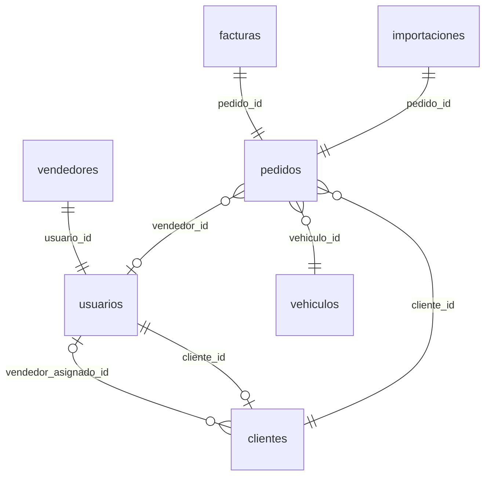
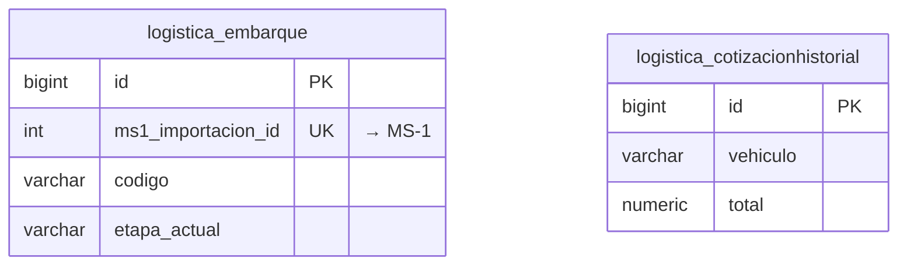

# Esquemas de base de datos — 3 microservicios

Cada MS tiene **almacenamiento propio**. Los enlaces entre servicios son por **ID** (no foreign keys cruzadas).

```
┌─────────────────────┐   ┌─────────────────────┐   ┌──────────────────────────┐
│  MS-1               │   │  MS-2               │   │  MS-3                    │
│  PostgreSQL         │   │  PostgreSQL         │   │  DynamoDB + S3           │
│  importadora_       │   │  importadora_ms2    │   │  ms3-documentos          │
│  vehiculos          │   │                     │   │  ms3-inspecciones        │
│  :5432              │   │  :5432              │   │  :8000 + MinIO :9000     │
└──────────┬──────────┘   └──────────┬──────────┘   └──────────────────────────┘
           │                         │
           │    ms2_embarque_id ◄────┤ ms1_importacion_id
           └─────────────────────────┘
```

Scripts por microservicio:

| MS | Lenguaje | Archivo | Ejecutar |
|----|----------|---------|----------|
| MS-1 | **SQL** PostgreSQL | `infra/db/schemas/ms1-setup.sql` | `.\infra\scripts\create-ms1-database.ps1` |
| MS-2 | **SQL** PostgreSQL | `infra/db/schemas/ms2-setup.sql` | `.\infra\scripts\create-ms2-database.ps1` |
| MS-3 | **Python** DynamoDB+S3 | `infra/db/schemas/ms3-setup-dynamodb.py` | `.\infra\scripts\create-ms3-database.ps1` |

---

## MS-1 — `importadora_vehiculos` (PostgreSQL)

**8 tablas** — núcleo de negocio

| Tabla | Descripción |
|-------|-------------|
| `usuarios` | Login, roles JWT |
| `clientes` | Cartera de clientes |
| `vehiculos` | Catálogo VIN |
| `vendedores` | Perfil comercial |
| `pedidos` | Ventas |
| `importaciones` | Trámite aduanero (+ `ms2_embarque_id`) |
| `facturas` | Facturación |
| `notificaciones` | Alertas por rol |



DDL completo: [ms1-importadora_vehiculos.sql](../infra/db/schemas/ms1-importadora_vehiculos.sql)

---

## MS-2 — `importadora_ms2` (PostgreSQL)

**2 tablas** — logística y cotizador

| Tabla | Descripción |
|-------|-------------|
| `logistica_embarque` | Seguimiento naviero (+ `ms1_importacion_id`) |
| `logistica_cotizacionhistorial` | Historial de cotizaciones CIF |



DDL completo: [ms2-importadora_ms2.sql](../infra/db/schemas/ms2-importadora_ms2.sql)

---

## MS-3 — DynamoDB + S3

**2 tablas DynamoDB** + **1 bucket S3**

| Recurso | Descripción |
|---------|-------------|
| `ms3-documentos` | Metadatos PDF/imágenes + OCR |
| `ms3-inspecciones` | Análisis IA de vehículos |
| S3 `importadora-ms3-docs` | Archivos binarios |

Esquema detallado: [ms3-dynamodb-s3.md](../infra/db/schemas/ms3-dynamodb-s3.md)

---

## Cómo crear las 3 bases

```powershell
# Un solo script para las 3 bases
cd infra
.\scripts\create-all-databases.ps1

# 2. MS-1 — tablas vía Hibernate al arrancar Spring Boot
cd ms-1-principal
mvn spring-boot:run

# 3. MS-2 — tablas vía Django migrate
cd ms-2-ml
python manage.py migrate

# 4. MS-3 — tablas DynamoDB al arrancar API
cd ms-3-dl
.\scripts\start.ps1
```

## Ver tablas creadas

```powershell
# MS-1 y MS-2 (PostgreSQL)
docker exec importadora-postgres psql -U postgres -d importadora_vehiculos -c "\dt"
docker exec importadora-postgres psql -U postgres -d importadora_ms2 -c "\dt"

# MS-3 (DynamoDB Local)
aws dynamodb list-tables --endpoint-url http://localhost:8000
```
